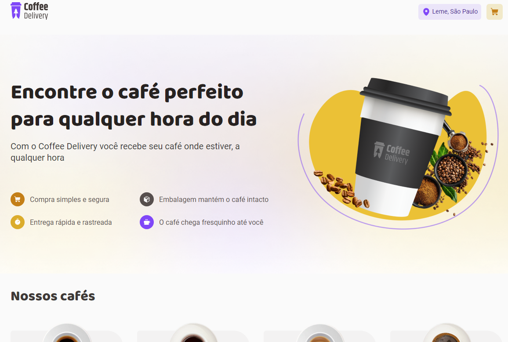

# Coffee Delivery

<p align="center">
  

  
 
  <a href="https://github.com/GianDutra/coffee-delivery/commits/master">
    
  </a>
  

  <a href="https://coffee-delivery-ashen-chi.vercel.app/">
    
  </a>
</p>

> Segundo desafio da trilha react.js da Rocketseat.

## Linguagens e Tecnologias usadas

Para criar o site foi utilizado:

#### **Website**  ([React](https://reactjs.org/)  +  [TypeScript](https://www.typescriptlang.org/) + [Vite](https://vitejs.dev/))

- **[PhosphorIcons](https://phosphoricons.com/)**
- **[Zod](https://zod.dev/)**
- **[React Router](https://v5.reactrouter.com/web/guides/quick-start)**
- **[Styled Components](https://styled-components.com/)**
- **[React Hook Form](https://react-hook-form.com/)**
- **[Axios](https://axios-http.com/)**
- **[Immer](https://immerjs.github.io/immer/)**

 #### **API's**
- **[Via CEP](https://viacep.com.br/)**
- **[Open Cage Data](https://opencagedata.com/)**
  
## Ajustes e melhorias

Além do que foi pedido para o desafio, realizei:

- [x] Responsividade no site
- [x] Conectar API para geolocalização
- [x] Conectar API para preencher CEP automático 
- [x] Carrinho vazio

## 💻 Pré-requisitos

Antes de começar, verifique se você possui instalado:

* Node.js
* Git
* Visual Studio Code (ou semelhante)

## 🚀 Instalando <Cofee_delivery>

 
```bash

# Clone este repositório
$ git clone git@github.com:GianDutra/coffee-delivery.git

# Acesse a pasta do projeto no seu terminal
$ cd coffee-delivery

# Instale as dependências
$ npm install

# Rode o aplicativo no modo de desenvolvedor
$ npm run dev

# O aplicativo vai abrir por padrão na porta: 3000 - vá para http://localhost:3000/

```

---


## 👨‍💼 Autor

<table>
  <tr>
    <td align="center">
      <a href="#">
        <br>
        <sub>
          <b>Gian Dutra</b>
        </sub>
      </a>
    </td>
  </tr>
</table>

